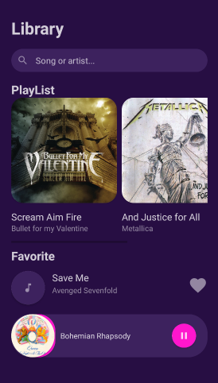

# Music App

Aplicación Mobile simple donde se ejemplifica la vista principal de una aplicación para reproducción de música utilizando componentes mobile con XML y creando una lógica simple con Kotlin.

## Características

Dentro de la construcción de la aplicación se ven conceptos como:

* Uso de **Constraint Layout** para posicionamiento de componentes en pantalla tratando de crear una vista plana en pantalla.
* Uso de componentes básicos como **TextView, EditText, ImageView**.
* Uso de **CardView** para dar estilos avanzados a las imágenes como bordes redondeados.
* Uso de **HorizontalScrollView** para visualización y navegación de componentes de forma horizontal.
* Uso de eventos **OnClick** para crear lógica de interactividad con el usuario.

# Resultado

A continuación se muestra el resultado de la replica de la aplicación mobile de música:

    
    
Resultado Aplicación mobile de música

    
    
Estructura Aplicación mobile de música

